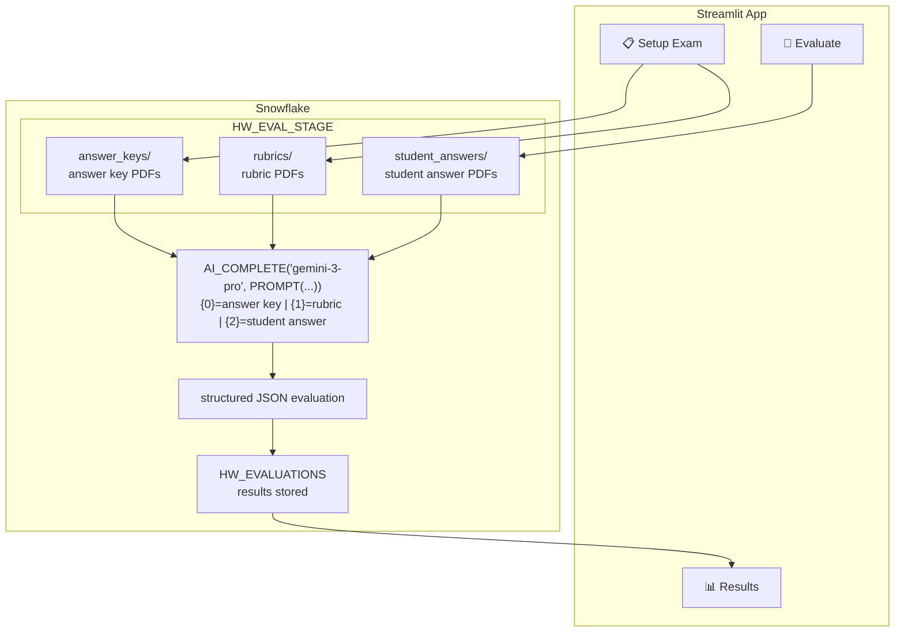

# AI-Powered Handwritten Answer Evaluation System

An end-to-end Streamlit application that uses **Snowflake Cortex AI** to automatically evaluate handwritten student answer sheets against an answer key and marking rubric — providing marks, grades, question-wise feedback, strengths, and recommendations.

---

## Overview

| Layer | Technology |
|---|---|
| Frontend | Streamlit (multi-page) |
| Database & Storage | Snowflake (`IITJ.MH`) |
| File Storage | Snowflake Stage (`HW_EVAL_STAGE`, SSE-encrypted) |
| AI Evaluation | Snowflake Cortex `AI_COMPLETE` via `PROMPT()` |
| Default Model | `gemini-3-pro` (10 MB PDF limit) |
| Alternate Model | `claude-sonnet-4-5` (4.5 MB PDF limit) |

All three PDFs — answer key, rubric, and student handwritten answer — are passed **directly** to the AI model inside a single `AI_COMPLETE` call via Snowflake's `PROMPT()` function. There is **no separate OCR step**.

---

## Architecture



---

## Evaluation Pipeline

```mermaid
flowchart TD
  subgraph T[Teacher setup once per exam]
    AKF[answer_key.pdf] --> AKS[Snowflake Stage answer_keys/]
    RBF[rubric.pdf] --> RBS[Snowflake Stage rubrics/]
  end

  subgraph S[Student evaluation]
    SAF[student_answer.pdf] --> SAS[Snowflake Stage student_answers/]
  end

  AKS --> CALL
  RBS --> CALL
  SAS --> CALL

  CALL[Single AI_COMPLETE call via PROMPT()<br/>{0} answer key PDF<br/>{1} rubric PDF<br/>{2} student handwritten PDF]
  CALL --> JSON[Structured JSON evaluation result<br/>per-question marks and feedback<br/>total marks, percentage, grade<br/>strengths and recommendations]

  JSON --> UI[Display rich UI]
  JSON --> SAVE[Save to HW_EVALUATIONS]
```

---

## Features

- **PDF-native evaluation** — upload scanned handwritten answer sheets directly; no manual transcription or OCR pre-processing
- **Single AI_COMPLETE call** — all three PDFs (answer key, rubric, student answer) are sent together in one request via Snowflake's `PROMPT()` multimodal function
- **Structured JSON grading** — per-question marks, correctness status, and specific feedback
- **Rich results UI**
  - 🟢 Correct / 🟡 Partially Correct / 🔴 Incorrect badge per question
  - Progress bar showing marks scored per question
  - `st.success` (green) cards for Strengths
  - `st.warning` (yellow) cards for Areas for Improvement
  - `st.info` (blue) cards for Recommendations
- **Results dashboard** — filter by exam, student name, and grade; grade distribution chart
- **Auto schema migration** — Snowflake tables and stage are created automatically on first run
- **Dual-environment auth** — runs locally (via `secrets.toml`) or natively inside Streamlit in Snowflake

---

## Grading Scale

| Grade | Percentage |
|---|---|
| A+ | ≥ 90% |
| A  | ≥ 80% |
| B+ | ≥ 70% |
| B  | ≥ 60% |
| C  | ≥ 50% |
| D  | ≥ 40% |
| F  | < 40% |

---

## Supported AI Models

| Model | PDF Size Limit | Notes |
|---|---|---|
| `gemini-3-pro` | **10 MB** | **Default** — best for large scanned answer sheets |
| `claude-sonnet-4-5` | **4.5 MB** | Alternate option — Claude 3.5 Sonnet via Snowflake Cortex |

Select the model from the **sidebar** on the Evaluate page. Use `gemini-3-pro` for high-resolution scans; switch to `claude-sonnet-4-5` for smaller, well-formatted PDFs.

---

## Snowflake Objects (auto-created on first run)

| Object | Type | Purpose |
|---|---|---|
| `IITJ.MH.HW_EVAL_STAGE` | Stage (SSE-encrypted) | Stores all uploaded PDFs |
| `IITJ.MH.HW_EXAMS` | Table | Exam metadata and stage file paths |
| `IITJ.MH.HW_EVALUATIONS` | Table | AI evaluation results per student |

### `HW_EXAMS` schema

| Column | Type | Description |
|---|---|---|
| `EXAM_ID` | NUMBER (autoincrement) | Primary key |
| `EXAM_NAME` | VARCHAR | Name of the exam |
| `SUBJECT` | VARCHAR | Subject / course name |
| `ANSWER_KEY_FILE` | VARCHAR | Stage-relative path to answer key PDF |
| `RUBRIC_FILE` | VARCHAR | Stage-relative path to rubric PDF |
| `TOTAL_MARKS` | NUMBER | Maximum marks for the exam |
| `CREATED_AT` | TIMESTAMP_NTZ | Creation timestamp |

### `HW_EVALUATIONS` schema

| Column | Type | Description |
|---|---|---|
| `EVAL_ID` | NUMBER (autoincrement) | Primary key |
| `EXAM_ID` | NUMBER | Foreign key → `HW_EXAMS` |
| `STUDENT_NAME` | VARCHAR | Student's name |
| `STUDENT_ANSWER_FILE` | VARCHAR | Stage-relative path to student's answer PDF |
| `AI_EVALUATION` | VARCHAR(16M) | Full JSON evaluation from the AI model |
| `TOTAL_MARKS_OBTAINED` | FLOAT | Marks awarded |
| `TOTAL_MARKS_POSSIBLE` | FLOAT | Maximum marks |
| `PERCENTAGE` | FLOAT | Score percentage |
| `GRADE` | VARCHAR | Letter grade |
| `EVALUATED_AT` | TIMESTAMP_NTZ | Evaluation timestamp |

---

## Project Structure

```
AI POWERED HANDWRITTEN EVAL/
├── Home.py                    # Entry point: Snowflake connection, DB/stage/table setup
├── pages/
│   ├── 01_Setup_Exam.py       # Upload answer key + rubric PDFs, define exam metadata
│   ├── 02_Evaluate.py         # Upload student PDF, run AI_COMPLETE, display + save results
│   └── 03_Results.py          # Results dashboard: filters, metrics, grade distribution
├── utils.py                   # Shared constants, file helpers, grade logic, UI renderer
├── .streamlit/
│   └── secrets.toml           # Snowflake credentials (local only — gitignored)
├── requirements.txt
└── .gitignore
```

---

## Setup

### Prerequisites

- Python 3.9+
- Conda (recommended) or pip
- Snowflake account with **Cortex AI** enabled
- Role with `CREATE STAGE`, `CREATE TABLE`, and Cortex `AI_COMPLETE` grants (e.g. `ACCOUNTADMIN`)

### 1. Clone and install dependencies

```bash
git clone <repo-url>
cd "AI POWERED HANDWRITTEN EVAL"
conda activate monty_streamlit   # or your preferred env
pip install -r requirements.txt
```

### 2. Configure Snowflake credentials

Create `.streamlit/secrets.toml`:

```toml
[connections.snowflake]
account   = "YOUR_ACCOUNT_IDENTIFIER"
user      = "YOUR_USERNAME"
password  = "YOUR_PASSWORD"
role      = "ACCOUNTADMIN"
warehouse = "COMPUTE_WH"
database  = "iitj"
schema    = "mh"
```

> **Note:** This file is listed in `.gitignore` and must never be committed.

### 3. Run the app

```bash
streamlit run Home.py
```

Open **http://localhost:8501** in your browser.

On first launch the app automatically creates the Snowflake stage and tables.

---

## Usage

### Step 1 — Setup Exam (`📋 Setup Exam`)

1. Enter the exam name and subject
2. Upload the **answer key PDF** (typed or scanned)
3. Upload the **marking rubric PDF**
4. Set the total marks available
5. Click **Save Exam** — both PDFs are stored in Snowflake Stage

### Step 2 — Evaluate Student (`🎯 Evaluate`)

1. Select the exam from the dropdown
2. Enter the student's name
3. Upload the **student's handwritten answer sheet** as a PDF
4. (Optional) Switch the AI model in the sidebar
5. Click **Run AI Evaluation**

The system will:
- Upload the answer sheet to Snowflake Stage
- Call `AI_COMPLETE` with all three PDFs passed via `PROMPT()` — no OCR step
- Parse the structured JSON response
- Display a rich evaluation report — per-question breakdown, overall feedback, strengths, and recommendations
- Save the full evaluation to `HW_EVALUATIONS`

### Step 3 — View Results (`📊 Results`)

- Filter evaluations by exam, student name, or grade
- View summary metrics: total evaluations, average marks, average percentage, pass rate
- Drill into any individual evaluation for the full question-wise breakdown
- View grade distribution as a bar chart

---

## Notes

- **Scan quality**: Handwritten PDFs work best when scanned at ≥ 300 DPI
- **File size**: For large answer sheets (> 4.5 MB), use `gemini-3-pro` (supports up to 10 MB)
- **Snowflake Native App**: Compatible with Streamlit in Snowflake — uses `get_active_session()` when available, with `secrets.toml` as local fallback
- **File naming**: All uploaded files are prefixed with a Unix timestamp to prevent name collisions in the stage

---

## Requirements

```
streamlit
snowflake-snowpark-python
```
